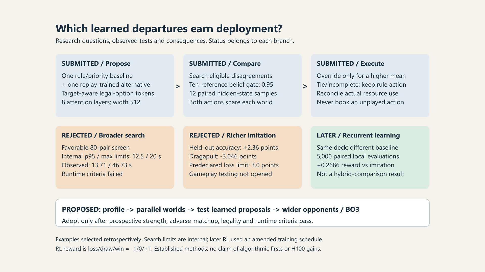
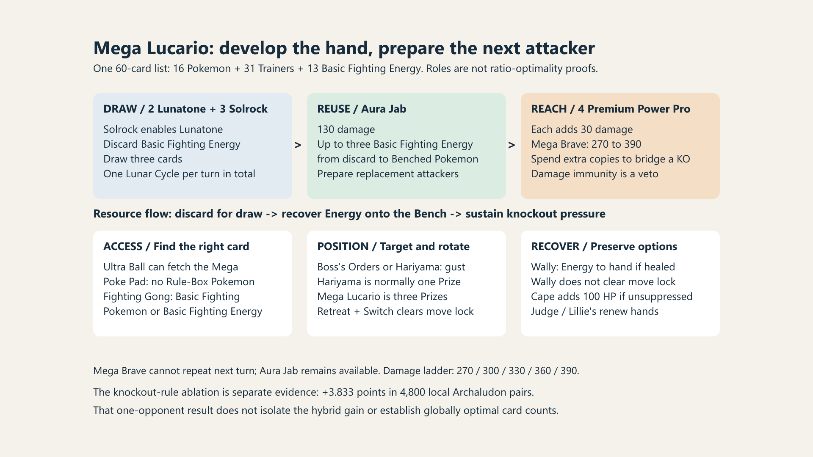

# Gallery: overview, research decisions and deck resources

These original diagrams introduce the argument and complement the main report's inline decision trace. Read the overview first, then inspect research decisions and deck resources. All three use a 16:9 canvas.

## Start here: the question, the system and the evidence

One fixed deck creates competing uses for cards and Energy. The submitted hybrid asks whether a learned alternative should replace a rule-based choice, compares eligible disagreements in the same twelve sampled hidden states, and keeps its resource bookkeeping consistent with the action actually played. The research loop summarizes the writeup's hypothesis, failure-criterion, test and decision examples; those examples were selected retrospectively. The +12.59-point figure rounds the +12.587-point, historically weighted local confirmation result from 500 pairs against the same-deck rule/priority baseline (paired SE 4.026 points). The separate later reinforcement learner's 45.68% versus 32.28% win rates come from 5,000 equally weighted local pairs against its own imitation baseline. These are different comparisons, not a ranking of the two systems. The later training schedule was extended after development results; checkpoint selection preceded the final evaluation. Additional-compute interventions are proposed, with no measured H100 gain. Details and limitations remain in the main report and the linked evidence pages.

[Full-resolution image](overview.png) | [Editable vector](overview.svg).

## Research questions and adoption decisions

Our submitted Mega Lucario system generates a rule-based choice and a replay-trained alternative, compares eligible disagreements, and reconciles actual resource use after an override. The selected research examples show why broader search and richer imitation were rejected. The separate post-submission recurrent learner improved on replay imitation, not on the submitted hybrid. Future interventions remain proposed. The RL reward scale is loss/draw/win = -1/0/+1; its schedule was amended after development outcomes. These examples illustrate decisions, not unique algorithm families or a predicted finalist-hardware gain.

[Full-resolution image](research_decisions.png) | [Editable vector](research_decisions.svg).

## Mega Lucario resource interactions

The submitted deck links hand development to attacker preparation: with Solrock present, Lunatone discards Basic Fighting Energy to draw, limited to one Lunar Cycle per turn across all copies. Aura Jab can reuse discarded Energy on the Bench. Damage modifiers and target access then support knockouts. Wally returns attached Energy only if it heals damage. The lower row organizes access, positioning and recovery tools; these are conditional interactions, not a guaranteed sequence. The exact counts are in the main report. Card roles and the one-opponent knockout-rule ablation do not establish optimal ratios.

[Full-resolution image](deck_resources.png) | [Editable vector](deck_resources.svg).

The diagrams contain no official card artwork or reconstructed gameplay footage. Hypothetical future work is labelled as proposed. See the [scope notice](NOTICE.md) and [version identity](VERSION.json).
